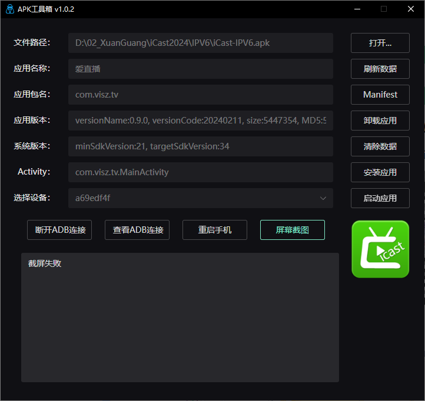
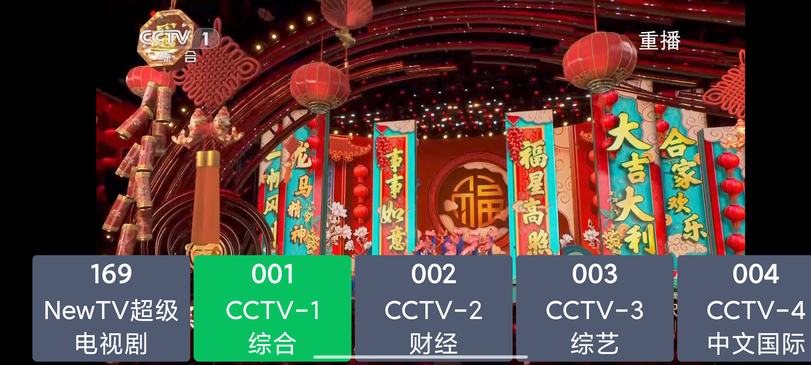

# 爱直播

Android IPTV 播放器

## 使用

**有IPV6和IPV4两个版本：**
**IPV6 版本：**
手机上播放正常，电视或盒子可能不正常。

直播源是从 https://github.com/Meroser/IPTV 获取。
数据保存在：com.visz.tv.utils.ChannelUtil.IPV6_CHANNEL，
如果需要自己定制可以修改这里数据。

**IPV4 版本：**
电视和盒子上播放正常，有些流是加密的，播放不了。

直播源是从 https://github.com/lizongying/my-tv 获取，加密的用不了。
数据保存在：com.visz.tv.utils.ChannelUtil.IPV4_CHANNEL，
如果需要自己定制可以修改这里数据。

## APK 信息

## 应用截图

## 微信交流

