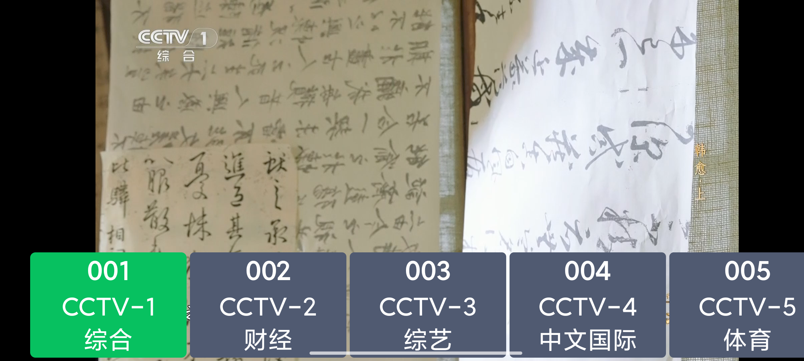

# 爱直播

Android IPTV 播放器

## 使用

**手机使用 IPV6 版本：**
直播源是从 https://github.com/Meroser/IPTV 获取，存放在 raw/ipv6_channels.m3u文件。

**电视和盒子使用 TVBOX 版本：**
直播源是从 https://github.com/lizongying/my-tv 获取，在 ChannelUtil.java 中，加密的用不了。

## APK 信息

## 应用截图

## 微信交流

